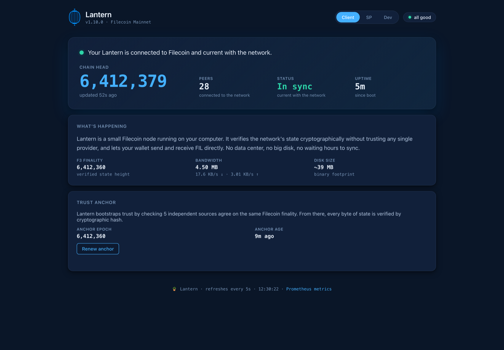

# Milestone 1 verification: trustless multi-source head quorum

Lantern v1.10.0 · ProPGF milestone 1 · report dated 2026-09-29, final soak snapshot 2026-09-30

This is the public verification report for Milestone 1. It lists each completion criterion, the code that meets it, and the evidence from mainnet.

- Release: https://github.com/Reiers/lantern/releases/tag/v1.10.0
- Changelog: [CHANGELOG.md](../CHANGELOG.md), section "v1.10.0"
- Design: [TRUST-MODEL.md §2.8 Running-head quorum](../TRUST-MODEL.md#28-running-head-quorum-v1100-milestone-1)
- Install: `curl -fsSL https://get.golantern.io | bash`

## Criteria

| Criterion | Where | Status |
|---|---|---|
| Released tag with head-source corroboration across N independent sources | v1.10.0: #152 (tipset-key agreement), #153 (independence per upstream operator), #154 (libp2p peer-group votes), #160 (standalone daemon runs it) | Met |
| Heaviest-ParentWeight fork choice | #152 cross-source fork choice (most independent voters, then heaviest `ParentWeight`); #79 gossip fork choice; #155 guarded head adoption; #156 weight-monotonic guard | Met |
| `--no-fallback-rpc` mode with zero trusted-RPC dependency | #154 peer-group quorum; live run below | Met |
| VM-bridge cross-check auditor with divergence alarms | `--vm-crosscheck` (#98, since v1.9.0), unchanged | Met |
| ChainExchange client for gateway-free header fetch | `net/chainxchg` (since v1.9.0), unchanged | Met |
| Public release notes documenting the quorum design and fork-choice rule | Release notes, CHANGELOG v1.10.0, TRUST-MODEL §2.8, this report | Met |
| Beacon running the tagged build with `--dht-announce` | Production beacon on v1.10.0, `--dht-announce`, tcp/udp 4001 | Met |
| Multi-day quorum-agreed head with no single-source dependency (7 days committed in review) | Production soak, table below: 6 days 23 hours, 2026-09-23 13:28 UTC to 2026-09-30 12:30 UTC | Met |

## How the quorum works (short)

Every 30 s the node compares its head with independent voters at a lookback of 3 epochs. A voter agrees only if its tipset **key** at that epoch is on our canonical chain. RPC voters count once per upstream operator (the Lantern gateway votes as its upstream, Glif). libp2p peers vote once per network group (IPv4 /16, IPv6 /32). Disagreement is resolved by most independent voters, then heaviest `ParentWeight`. At least 2 independent agreeing voters are required. A `diverge` result closes the adoption gate until the head is re-corroborated. Full detail and honest limits: TRUST-MODEL §2.8.

## Evidence 1: production soak on mainnet

A production census node running the M1 code (v1.10.0-rc1 from 2026-09-23 13:28 UTC, upgraded in place to v1.10.0 on 2026-09-29 10:22 UTC; the head-quorum code is identical). Collected daily from `/metrics` and the service journal.

| Day (UTC) | Restarts | Status | Voters agree / disagree | Peer groups | Rounds (cumulative) | Diverged (cumulative) | libp2p peers |
|---|---|---|---|---|---|---|---|
| 2026-09-25 07:00 | 0 | agree | 55 / 0 | 53 | 4,925 | 2 | 106 |
| 2026-09-26 07:00 | 0 | agree | 46 / 0 | 44 | 7,770 | 2 | 163 |
| 2026-09-27 07:00 | 0 | agree | 52 / 0 | 50 | 10,624 | 2 | 154 |
| 2026-09-28 07:00 | 0 | agree | 62 / 0 | 60 | 13,465 | 2 | 164 |
| 2026-09-29 09:00 | 0 | agree | 51 / 0 | 49 | 16,548 | 2 | 154 |
| *upgrade to v1.10.0, 2026-09-29 10:22 (counters reset)* | | | | | | | |
| 2026-09-30 12:30 (final) | 0 | agree | 23 / 0 | 21 | 3,093 | 1 | 139 |

- Zero unplanned restarts. The only restart is the planned in-place upgrade to v1.10.0 (counters reset at that point).
- Last 24 h of the rc1 journal: 55,763 lines, 0 divergences, 0 panics.
- Two short divergence events in the whole soak (3 rounds out of more than 19,600):
  - 2026-09-24 12:53 UTC (2 rounds): local head 6398265 vs external median 6398266, 7 voters agreeing and 9 on a fork.
  - 2026-09-29 13:41 UTC (1 round): local head 6412761 vs external median 6412762, 9 agreeing and 9 on a fork of 20 reachable. Re-corroborated 30 seconds later with 15 agreeing.

  Both were 1-epoch forks at the tip. Each time the gate held head adoption and released it once the head was re-corroborated. No wrong head was adopted and nothing restarted. This is the gate doing its job.
- Head rejections over the soak: 4 lighter candidates, 0 non-monotonic weight, 15 held while diverged.
- Every daily snapshot showed between 23 and 62 independent agreeing voters and 0 disagreeing: no single source ever decided the head.


## Evidence 2: bridge-off (`--no-fallback-rpc`), zero trusted RPC

v1.10.0 standalone daemon on macOS arm64 with `--no-fallback-rpc`: no Glif, no fallback RPC, head from gossip only. The only non-peer voter is the Lantern gateway; the rest of the quorum is libp2p peer groups.

| Time (CEST) | Status | Voters agree / disagree | Peer groups | Rounds | Diverged | Peers | Local head / Glif head |
|---|---|---|---|---|---|---|---|
| 14:39 | agree | 34 / 0 | 33 | 9 | 0 | 11 | 6,412,638 / 6,412,639 |
| 14:45 | agree | 15 / 0 | 14 | 19 | 0 | 16 | 6,412,649 / 6,412,650 |
| 14:50 | agree | 26 / 0 | 25 | 29 | 0 | 30 | 6,412,659 / 6,412,660 |
| 14:55 | agree | 21 / 0 | 20 | 39 | 0 | 24 | 6,412,669 / 6,412,669 |
| 15:00 | agree | 46 / 0 | 45 | 49 | 0 | 42 | 6,412,679 / 6,412,679 |
| 15:05 | agree | 25 / 0 | 24 | 59 | 0 | 20 | 6,412,689 / 6,412,690 |
| 15:10 | agree | 32 / 0 | 31 | 69 | 0 | 18 | 6,412,699 / 6,412,700 |
| 15:15 | agree | 19 / 0 | 18 | 79 | 0 | 27 | 6,412,709 / 6,412,709 |

Run: started 14:35:50 CEST on 2026-09-29, sampled every 5 minutes, 40+ minutes of continuous operation at the time of writing. `agree` on every sample, 0 disagreeing voters, 0 divergences across 79 head-check rounds. The local head is equal to Glif or at most one epoch (one 30-second block) behind it, i.e. current with the network. Glif was queried only by the external sampling script for comparison, never by the daemon.

The daemon log contains no request to Glif or any other fallback RPC (`grep -cE 'api.node.glif.io|chain.love' daemon.log` returns `0`).


## Evidence 3: fresh installs

The public one-liner, from a clean home directory, no version pinned (resolves the latest release, v1.10.0), 2026-09-29:

| Platform | Version | Anchor source | Local head / Glif head | Voters agree / disagree | Peers |
|---|---|---|---|---|---|
| macOS arm64 (Apple M4) | v1.10.0 (06ccaf6) | `ec-multi-source` | 6412363 / 6412363 | 46 / 0 | 46 |
| Linux amd64 (Mac Pro 2013) | v1.10.0 (06ccaf6) | `ec-multi-source` | 6412362 / 6412363 | 41 / 0 | 56 |

Mainnet F3 finality has been stuck at epoch 5824156 (about 203 days behind the head). v1.10.0 detects this and anchors on EC multi-source agreement at the live head instead (#167), which is why both installs show `ec-multi-source`. Before this fix, `lantern init` failed on a fresh machine.



## Known limits and follow-ups

- The embedded `pkg/daemon` runs the RPC voters but has no Hello service yet, so it does not collect peer-group votes. The standalone daemon does.
- `ParentWeight` is checked for monotonicity, not recomputed from power state.
- Network groups raise the cost of faking a peer majority but do not make it impossible. F3 finality closes the un-finalized tip once it is producing certificates again.

## Reproduce

```sh
curl -fsSL https://get.golantern.io | bash
lantern daemon --metrics 127.0.0.1:9092          # add --no-fallback-rpc for bridge-off
curl -s 127.0.0.1:9092/metrics | grep lantern_headcheck
```
